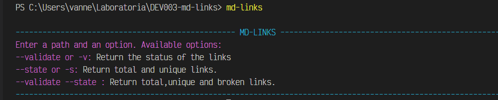

# Markdown Links

## Índice

* [1. Preámbulo](#1-preámbulo)
* [2. Resumen del proyecto](#2-resumen-del-proyecto)
* [3. Instalación](#3-instalacion)
* [4. Diagramas de flujo](#4-diagramas-de-flujo)
* [5. Comandos](#5-comandos)

***

## 1. Preámbulo

[Markdown](https://es.wikipedia.org/wiki/Markdown) es un lenguaje de marcado
ligero muy popular entre developers. Es usado en muchísimas plataformas que
manejan texto plano (GitHub, foros, blogs, ...) y es muy común
encontrar varios archivos en ese formato en cualquier tipo de repositorio
(empezando por el tradicional `README.md`).

Estos archivos `Markdown` normalmente contienen _links_ (vínculos/ligas) que
muchas veces están rotos o ya no son válidos y eso perjudica mucho el valor de
la información que se quiere compartir.

Dentro de una comunidad de código abierto, nos han propuesto crear una
herramienta usando [Node.js](https://nodejs.org/), que lea y analice archivos
en formato `Markdown`, para verificar los links que contengan y reportar
algunas estadísticas.

## 2. Resumen del proyecto

En este proyecto crearás una herramienta de línea de comando (CLI) así como tu
propia librería (o biblioteca - library) en JavaScript.

En esta oportunidad nos alejamos un poco del navegador para construir un
programa que se ejecute usando Node.js. Aprenderemos sobre procesos
(`process.env`, `process.argv`, ...), cómo interactuar con el sistema archivos,
cómo hacer consultas de red, etc.

[Node.js](https://nodejs.org/es/) es un entorno de ejecución para JavaScript
construido con el [motor de JavaScript V8 de Chrome](https://developers.google.com/v8/).
Esto nos va a permitir ejecutar JavaScript en el entorno del sistema operativo,
ya sea tu máquina o un servidor, lo cual nos abre las puertas para poder
interactuar con el sistema en sí, archivos, redes, ...

Diseñar tu propia librería es una experiencia fundamental para cualquier
desarrollador porque que te obliga a pensar en la interfaz (API) de tus
_módulos_ y cómo será usado por otros developers. Debes tener especial
consideración en peculiaridades del lenguaje, convenciones y buenas prácticas.

## 3. Instalación

#### `npm install vanesn-md-links`

## 4. Diagramas de flujo

### API

### CLI

### 5. Comados

Nuestra aplicación se ejecuta de la siguiente manera a través de la terminal:

#### `md-links <path-to-file> [options]`

### Menú de ayuda

Al ingresar el comando `md-links -h` se muestran las opciones disponibles para ejecutar

### Opciones

Al ingresar el comando `md-links path` donde path es la ruta del archivo que se desea analizar, nos mostrará las siguientes propiedas de cada link encontrado.

Al ingresar el comando `md-links path --validate` el módulo hace una petición HTTP para averiguar si el link funciona o no, retonando las siguientes propiedades.

Si pasamos la opción `--stats` el output (salida) obtenemos un texto con estadísticas básicas sobre los links, como el número total de links y links únicos

Al combinar `--stats` y `--validate` obtenemos links únicos, rotos y el total de links.

